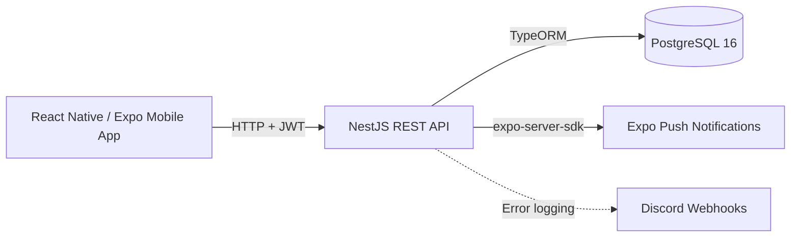
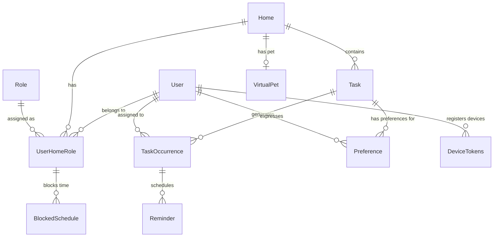

# Domus

Domus is a household collaboration and task management application designed to help shared households coordinate responsibilities, fairly distribute chores, and reduce the invisible mental load of managing a home.

Unlike generic to-do apps, Domus focuses on collaborative household dynamics: multiple members share a home, define recurring tasks, and rely on an automatic assignment algorithm that factors in workload, preferences, availability, and completion history to distribute tasks equitably.

## Features

- **Shared households** -- Create or join homes via invitation codes, with OWNER and MEMBER roles
- **Task management** -- Define recurring task templates (once, daily, weekly, monthly) with physical effort ratings
- **Task occurrences** -- Concrete, assignable instances generated from templates, each with a due date and responsible member
- **Automatic task assignment** -- Composite cost function that balances load, preference, history, and task affinity to select the fairest assignee
- **Manual assignment** -- Reassign individual occurrences to specific members
- **Task preferences** -- Like or dislike specific task types to influence assignment scoring
- **Availability blocking** -- Block time slots as recurring (weekly pattern) or temporal (date-range for vacations)
- **Reminders** -- Cron-based push notifications scheduled before due times
- **Push notifications** -- Expo-based delivery for assignments, reminders, and home membership events
- **Points and gamification** -- Earn points for completing tasks, scaled by physical effort and earliness
- **Virtual pet** -- Each home has a virtual pet that grows with household engagement (early-stage implementation)
- **Weekly activity** -- View recent task completions and member contributions per household
- **Soft deletes** -- Users and tasks are soft-deleted, preserving historical data

## Tech Stack

### Mobile / Frontend

| Technology | Purpose |
|---|---|
| React Native 0.81 | Cross-platform mobile framework |
| Expo SDK 54 | Development toolchain and native modules |
| Expo Router 6 | File-based navigation |
| NativeWind 4.2 + Tailwind CSS 3.4 | Utility-first styling |
| Zustand 5 | State management |
| Zod 4 | Form validation schemas |
| Axios | HTTP client with interceptors |
| TypeScript 5.9 | Type safety |

### Backend

| Technology | Purpose |
|---|---|
| NestJS 11 | Modular backend framework |
| TypeORM 0.3 | ORM with migration support |
| PostgreSQL 16 | Relational database |
| Passport + JWT | Stateless authentication |
| argon2 | Password hashing |
| Swagger / OpenAPI | API documentation |
| @nestjs/schedule | Cron-based job scheduling |
| expo-server-sdk | Push notification delivery |
| date-fns + date-fns-tz | Date arithmetic and timezone handling |
| TypeScript 5.7 | Type safety |

### Infrastructure

| Technology | Purpose |
|---|---|
| Docker / Docker Compose | Containerized development and deployment |
| pnpm 11.18 | Package management |
| EAS Build | Mobile app builds (development, preview, production) |
| Dokploy | Production API deployment |

## Architecture



The backend is a **modular monolith**: all features live in a single NestJS application with clear module boundaries. The frontend communicates with the backend via a REST API. Push notifications are delivered through Expo's push notification service. Error monitoring is forwarded to Discord via webhooks.

The **assignment algorithm** runs entirely on the backend. The frontend displays results but does not participate in assignment decisions.

## Project Structure

```
Domus/
├── docker-compose.yaml          # API + PostgreSQL orchestration
├── domu-api/                    # NestJS backend
│   ├── Dockerfile               # Multi-stage build (dev + production)
│   ├── src/
│   │   ├── main.ts              # App bootstrap, Swagger setup
│   │   ├── app.module.ts        # Root module (16 feature modules)
│   │   ├── auth/                # JWT authentication (login, register)
│   │   ├── users/               # User CRUD
│   │   ├── home/                # Household management, membership
│   │   ├── tasks/               # Task templates (recurring definitions)
│   │   ├── task-occurrences/    # Concrete task instances (assignable units)
│   │   ├── assignment/          # Automatic assignment algorithm
│   │   ├── preferences/         # User task preferences
│   │   ├── blocked-schedules/   # Availability blocking
│   │   ├── reminders/           # Scheduled reminder dispatch (cron)
│   │   ├── device-tokens/       # Push notification device registry
│   │   ├── push-notifications/  # Expo push delivery service
│   │   ├── virtual-pet/         # Gamification pet system
│   │   ├── role/                # Role definitions (OWNER, MEMBER)
│   │   ├── user-home-role/      # Membership junction table
│   │   ├── common/discord/      # Discord error logging
│   │   └── database/            # TypeORM config, migrations, seeds
│   ├── test/                    # E2E tests
│   └── API_CONTRACTS.md         # API integration rules
└── domus-front/                 # React Native / Expo mobile app
    ├── app.json                 # Expo configuration
    ├── eas.json                 # EAS Build profiles
    ├── app/                     # Expo Router file-based routes
    │   ├── (auth)/              # Login, register screens
    │   ├── (tabs)/              # Main tabs: home, tasks, family, profile
    │   ├── (profile)/           # Availability, task preferences
    │   └── tasks/               # Task create, detail screens
    ├── components/              # Reusable UI components by feature
    ├── api/                     # Axios API client modules
    ├── store/                   # Zustand stores (auth, home)
    ├── constants/               # Theme, colors, shared types
    ├── utils/                   # Device ID, push notifications, timezone
    ├── DESIGN.md                # Design system documentation
    └── UX_DECISIONS.md          # UX rationale and product decisions
```

## Getting Started

### Prerequisites

- **Node.js** 22 (required by Docker image; no `.nvmrc` is present)
- **pnpm** 11.18.0 (pinned in `domu-api/package.json`)
- **Docker** and **Docker Compose**
- **Expo CLI** (for running the mobile app locally)

### Installation

Clone the repository and install dependencies for each sub-project:

```bash
git clone <repository-url>
cd Domus

# Backend
cd domu-api
pnpm install

# Frontend
cd ../domus-front
pnpm install
```

### Environment Variables

The backend expects a `.env` file in `domu-api/`. Create it with the following variables:

```bash
# Database
DB_HOST=db            # 'db' when using Docker Compose, 'localhost' for local PostgreSQL
DB_PORT=5432
DB_USERNAME=your_user
DB_PASSWORD=your_password
DB_NAME=your_db_name

# Authentication
JWT_SECRET=your-secret-key-at-least-32-characters
JWT_EXPIRES_IN=7d

# Application
PORT=3000
APP_TIMEZONE=America/Mexico_City

# Monitoring (optional, safe to leave empty for local development)
DISCORD_WEBHOOK_URL=

# Push notifications
DEVICE_TOKEN_TTL_DAYS=60
```

The frontend expects a `.env` file in `domus-front/`:

```bash
EXPO_PUBLIC_API_URL=http://localhost:3000   # or your local network IP
```

The root `docker-compose.yaml` reads PostgreSQL credentials from the root `.env` file, defaulting to:

```bash
POSTGRES_USER=emilio
POSTGRES_PASSWORD=dev
POSTGRES_DB=domu_dev
POSTGRES_PORT=5432
```

### Database

Start PostgreSQL and the API using Docker Compose:

```bash
docker-compose up -d
```

This starts PostgreSQL 16 and the NestJS API. Migrations run automatically in production (`NODE_ENV=production`). For local development, run migrations manually:

```bash
cd domu-api
pnpm migration:run      # or pnpm m:r
pnpm seed               # seed the 3 default roles (OWNER, MEMBER, GUEST)
```

### Running the Backend

With Docker Compose (recommended):

```bash
docker-compose up
```

Without Docker (requires a local PostgreSQL instance):

```bash
cd domu-api
pnpm dev
```

The API starts on `http://localhost:3000`. Swagger documentation is available at `http://localhost:3000/api`.

### Running the Mobile Application

```bash
cd domus-front
pnpm start
```

This starts the Expo development server. Scan the QR code with Expo Go or run on a simulator with `pnpm ios` or `pnpm android`.

## Database / Domain Model

The database consists of 11 entities. The core design separates **task templates** (recurring definitions) from **task occurrences** (concrete, assignable instances).



Key relationships:

- **User** -- Application user with name, email, and hashed password
- **Home** -- A household with a name, invitation code, and accumulated points
- **UserHomeRole** -- Composite key junction (`user_id` + `home_id`) linking members to homes with a role
- **Task** -- A recurring template: name, description, physical effort (1-5), frequency (once/daily/weekly/monthly)
- **TaskOccurrence** -- A concrete instance with due date/time, responsible member, and completion timestamp
- **Preference** -- Per-user, per-task score: like (-1), neutral (0), dislike (+1)
- **BlockedSchedule** -- Recurring (day-of-week) or temporal (date-range) availability blocks
- **Reminder** -- Scheduled notification tied to an occurrence, dispatched by cron
- **VirtualPet** -- One per home, with a name and level
- **DeviceTokens** -- Push notification registrations keyed by user + device ID

## API

The backend exposes a REST API documented via Swagger at `/api`. Key resource groups:

| Module | Prefix | Purpose |
|---|---|---|
| Auth | `/auth` | Login and registration |
| Homes | `/homes` | Household management, membership, activity |
| Tasks | `/tasks` | Task template CRUD |
| Task Occurrences | `/task-occurrences` | Occurrence CRUD, completion, assignment |
| Assignment | `/assignment` | Automatic assignment (single and batch) |
| Preferences | `/preferences` | Task preference management |
| Availability | `/availability` | Blocked schedule CRUD |
| Device Tokens | `/device-tokens` | Push notification device registration |
| Virtual Pet | `/virtual-pet` | Pet management per home |

All endpoints except `/auth/login` and `/auth/register` require a valid JWT in the `Authorization: Bearer <token>` header.

## Notifications and Scheduled Jobs

Domus uses two cron jobs built with `@nestjs/schedule`:

1. **Reminder dispatcher** -- Runs every minute. Queries for pending reminders where `date_time <= now` and the occurrence is still active. Sends Expo push notifications and marks reminders as sent. Processes up to 100 reminders per tick.

2. **Stale device cleanup** -- Runs daily at 3:00 AM (in `APP_TIMEZONE`). Removes device tokens that haven't been seen in 60+ days.

Push notifications are delivered through Expo's server SDK. Three notification channels are used on Android:

- `tasks` -- Task assignment notifications
- `reminders` -- Upcoming task reminders
- `home` -- Home membership events (e.g., new member joined)

The frontend registers device tokens on app launch and on each return to the foreground (with a 6-hour heartbeat interval). Tokens are unregistered on logout.

## Time Zones

Time zone handling uses `date-fns-tz` with a configurable `APP_TIMEZONE` environment variable (defaults to `UTC`). All cron jobs, reminder calculations, and due date arithmetic reference this timezone. Date arithmetic anchors calculations to noon UTC to avoid daylight saving time edge cases.

## Development

### Backend Scripts

| Command | Description |
|---|---|
| `pnpm dev` | Start in watch mode |
| `pnpm build` | Production build |
| `pnpm start:prod` | Run production build |
| `pnpm test` | Run unit tests (Jest) |
| `pnpm test:e2e` | Run end-to-end tests |
| `pnpm lint` | Lint and auto-fix (ESLint) |
| `pnpm format` | Format code (Prettier) |
| `pnpm migration:run` | Run pending migrations |
| `pnpm migration:generate <name>` | Generate migration from entity diff |
| `pnpm migration:revert` | Revert last migration |
| `pnpm seed` | Seed default roles |

### Frontend Scripts

| Command | Description |
|---|---|
| `pnpm start` | Start Expo development server |
| `pnpm ios` | Run on iOS simulator |
| `pnpm android` | Run on Android emulator |
| `pnpm lint` | Lint (Expo ESLint) |

## Author

Developed by Emilio Jasso.
